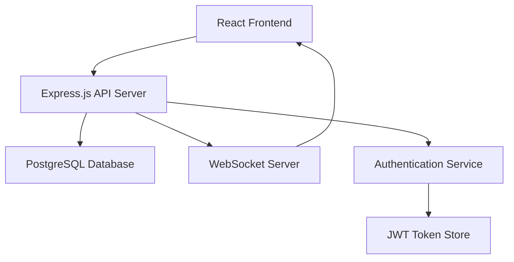

# Design Document

## Overview

The todo application with user assignments is designed as a full-stack web application using a modern three-tier architecture. The system consists of a React frontend, Node.js/Express backend API, and PostgreSQL database. The application emphasizes real-time collaboration, secure user authentication, and intuitive task management workflows.

## Architecture

### System Architecture



### Technology Stack

- **Frontend**: React 18 with TypeScript, React Router, Axios for API calls
- **Backend**: Node.js with Express.js, TypeScript, JWT for authentication
- **Database**: PostgreSQL with Prisma ORM for type-safe database operations
- **Real-time**: WebSocket connections for live notifications
- **Styling**: Tailwind CSS for responsive design
- **Testing**: Jest for unit tests, React Testing Library for component tests

## Components and Interfaces

### Frontend Components

#### Core Components
- `App`: Main application wrapper with routing and authentication context
- `AuthProvider`: Context provider for user authentication state
- `TaskList`: Main task display component with filtering and sorting
- `TaskItem`: Individual task display with assignment information
- `TaskForm`: Create/edit task form with user assignment dropdown
- `UserSelector`: Searchable dropdown for selecting task assignees
- `NotificationCenter`: Real-time notification display system

#### Layout Components
- `Header`: Navigation bar with user menu and logout
- `Sidebar`: Filter controls and task categories
- `Dashboard`: Main dashboard with task overview and statistics

### Backend API Endpoints

#### Authentication Endpoints
- `POST /api/auth/register`: User registration
- `POST /api/auth/login`: User authentication
- `POST /api/auth/logout`: Session termination
- `GET /api/auth/me`: Current user information

#### Task Management Endpoints
- `GET /api/tasks`: Retrieve user's tasks with filtering options
- `POST /api/tasks`: Create new task
- `GET /api/tasks/:id`: Get specific task details
- `PUT /api/tasks/:id`: Update task (creator or assignee only)
- `DELETE /api/tasks/:id`: Delete task (creator only)
- `PATCH /api/tasks/:id/status`: Update task completion status

#### User Management Endpoints
- `GET /api/users`: Get list of users for assignment (authenticated users only)
- `GET /api/users/:id`: Get user profile information

### WebSocket Events
- `task:assigned`: Notify user when task is assigned to them
- `task:completed`: Notify task creator when assignee completes task
- `task:updated`: Notify relevant users of task changes

## Data Models

### User Model
```typescript
interface User {
  id: string;
  email: string;
  name: string;
  passwordHash: string;
  createdAt: Date;
  updatedAt: Date;
}
```

### Task Model
```typescript
interface Task {
  id: string;
  title: string;
  description?: string;
  status: 'pending' | 'in_progress' | 'completed';
  priority: 'low' | 'medium' | 'high';
  dueDate?: Date;
  createdAt: Date;
  updatedAt: Date;
  creatorId: string;
  assigneeId?: string;
  
  // Relations
  creator: User;
  assignee?: User;
}
```

### Database Schema
```sql
-- Users table
CREATE TABLE users (
  id UUID PRIMARY KEY DEFAULT gen_random_uuid(),
  email VARCHAR(255) UNIQUE NOT NULL,
  name VARCHAR(255) NOT NULL,
  password_hash VARCHAR(255) NOT NULL,
  created_at TIMESTAMP DEFAULT NOW(),
  updated_at TIMESTAMP DEFAULT NOW()
);

-- Tasks table
CREATE TABLE tasks (
  id UUID PRIMARY KEY DEFAULT gen_random_uuid(),
  title VARCHAR(255) NOT NULL,
  description TEXT,
  status VARCHAR(20) DEFAULT 'pending',
  priority VARCHAR(10) DEFAULT 'medium',
  due_date TIMESTAMP,
  created_at TIMESTAMP DEFAULT NOW(),
  updated_at TIMESTAMP DEFAULT NOW(),
  creator_id UUID NOT NULL REFERENCES users(id) ON DELETE CASCADE,
  assignee_id UUID REFERENCES users(id) ON DELETE SET NULL
);

-- Indexes for performance
CREATE INDEX idx_tasks_creator_id ON tasks(creator_id);
CREATE INDEX idx_tasks_assignee_id ON tasks(assignee_id);
CREATE INDEX idx_tasks_status ON tasks(status);
CREATE INDEX idx_tasks_due_date ON tasks(due_date);
```

## Error Handling

### Frontend Error Handling
- **Network Errors**: Display user-friendly messages with retry options
- **Validation Errors**: Real-time form validation with clear error messages
- **Authentication Errors**: Automatic redirect to login page with session cleanup
- **Permission Errors**: Clear messaging when users lack access to resources

### Backend Error Handling
- **Input Validation**: Comprehensive request validation using Joi or similar
- **Database Errors**: Proper error logging with sanitized user messages
- **Authentication Failures**: Secure error responses without information leakage
- **Rate Limiting**: Implement rate limiting to prevent abuse

### Error Response Format
```typescript
interface ErrorResponse {
  success: false;
  error: {
    code: string;
    message: string;
    details?: any;
  };
}
```

## Testing Strategy

### Unit Testing
- **Backend**: Test all API endpoints, business logic, and database operations
- **Frontend**: Test individual components, hooks, and utility functions
- **Models**: Test data validation and transformation logic

### Integration Testing
- **API Integration**: Test complete request/response cycles
- **Database Integration**: Test database operations with test database
- **Authentication Flow**: Test complete login/logout workflows

### End-to-End Testing
- **User Workflows**: Test complete user journeys from login to task completion
- **Assignment Workflows**: Test task assignment and notification flows
- **Cross-browser Testing**: Ensure compatibility across major browsers

### Test Data Management
- **Fixtures**: Predefined test data for consistent testing
- **Database Seeding**: Automated test data setup and teardown
- **Mock Services**: Mock external dependencies for isolated testing

## Security Considerations

### Authentication & Authorization
- **JWT Tokens**: Secure token-based authentication with appropriate expiration
- **Password Security**: Bcrypt hashing with appropriate salt rounds
- **Session Management**: Secure session handling with proper cleanup
- **Role-based Access**: Ensure users can only access their own tasks and assigned tasks

### Data Protection
- **Input Sanitization**: Prevent XSS and injection attacks
- **SQL Injection Prevention**: Use parameterized queries through ORM
- **CORS Configuration**: Proper cross-origin resource sharing setup
- **Rate Limiting**: Prevent brute force and DoS attacks

### Privacy
- **Data Minimization**: Only collect and store necessary user information
- **Access Logging**: Log access patterns for security monitoring
- **Secure Headers**: Implement security headers (HSTS, CSP, etc.)